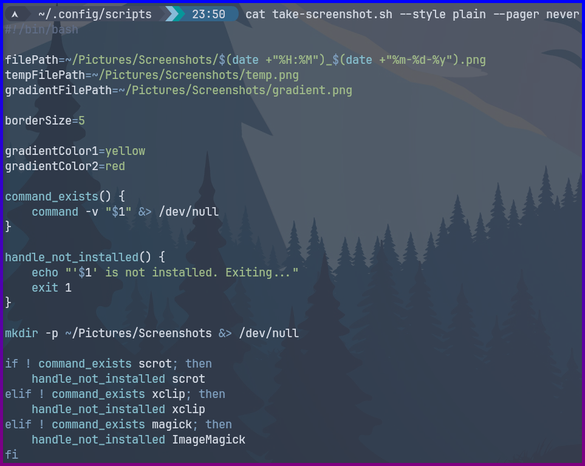

# Screenshot Script

## Features

- Takes a screenshot with a selectable area.
- Adds a gradient border to the screenshot.
- Colors and size of the gradient border are configurable in the script.
- Saves the screenshot in the `~/Pictures/Screenshots/` directory, with a timestamp.
- Copies the screenshot to the clipboard.

## Prerequisites

This script depends on the following programs, they must be installed in the environment where the script runs.

- `scrot`: Tool for taking screenshots.
- `xclip`: Tool for copying images to the clipboard.
- `ImageMagick`: Tool for image processing.

## Example

## Installation
`git clone https://github.com/DatCodeMania/LinuxSSTool.git`

`cd LinuxSSTool`

`chmod +x take-screenshot.sh`

`./take-screenshot.sh`

From here on out, you can then move this script to wherever you want, e.g. `~/.config/scripts`, and then call it using your WM/DE with a keybind, or any other method of your choosing.
